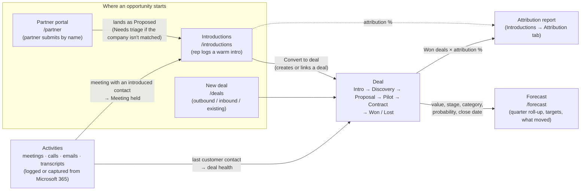

# StradIT CRM Core — Phase 1 implementation plan

Branch: `feature/crm-core-phase1` · Written 2026-09-24 · Status: **M0–M5 built (see §10); M4 waits for Azure credentials**

Goal: give StradIT the Salesforce basics it actually uses, inside this app. We extend what already
exists (accounts, personas, deals, action items, users, account access, copilot) instead of adding a
second CRM next to it.

| # | Salesforce feature | StradIT equivalent | Phase |
|---|---|---|---|
| 1 | Accounts, contacts, opportunities, activities | Core data model, plus custom objects for **Introductions** (connector, status, attribution) and **Business Line** (FS / Federal / Training) | 1 |
| 2 | Pipeline stages and forecasting | Our stages (Intro → Discovery → Proposal → Pilot → Contract) with forecast rollups | 1 |
| 3 | Einstein Activity Capture | Auto-log email, calendar and transcripts to records | 1 |
| 4 | Role-based permissions and sharing | Role-based access; partner/advisor views limited to their own intros | 1 |

---

## 0. How it all connects: Introductions → Deals → Forecast

Yes, the three are linked. They are **one flow over one object**: an opportunity is a row in `deals`.
Introductions feed deals, and the forecast is a read-only roll-up of deals. Activities (logged or
captured from Microsoft 365) run alongside and update all of them.

### 0.1 The big picture



The same flow as plain text:

```
 Partner portal ──┐
                  ▼
 Connector ──► INTRODUCTION ──(Convert)──► DEAL ──(stage / category / value / close date)──► FORECAST
               Proposed                    Intro                                              quarter totals
               Requested                   Discovery                                          vs targets
               Accepted                    Proposal                                           weekly "what moved"
               Intro made                  Pilot
               Meeting held ◄── activity   Contract
               Converted ─────────────────► Won ──► counts as Closed won in the forecast
                                                └─► Attribution: sourced won × attribution %
 New deal (no intro) ──────────────────────►DEAL
```

### 0.2 Start points (three ways in)

| Start | Who | Where | What happens next |
|---|---|---|---|
| **A. Warm introduction** | A rep logs that a partner, advisor, employee or customer introduced them to someone | `/introductions` → **New introduction** | The intro moves through its statuses. **Convert to deal** creates the deal |
| **B. Partner submission** | A partner types the company and contact | `/partner` → **Submit an introduction** | Becomes a *Proposed* introduction. If the company isn't recognised it shows as **Needs triage** until a rep links the account. Then it continues as A |
| **C. Direct deal** | A rep finds an opportunity without an intro (outbound, inbound, existing customer) | `/deals` → **New deal** | Starts at the chosen stage. No introduction and no attribution |

All three end up as a **deal**, and from there everything works the same way.

### 0.3 Step by step: the warm-intro journey

| # | Step | Screen | What the system records / does automatically |
|---|---|---|---|
| 1 | Add the **connector** (who makes intros) with a default attribution % | Introductions → Connectors | `connectors`. Attribution default chain: intro → connector → org setting (**50 %**) |
| 2 | Log the **introduction** (connector, account, contact, business line, context) | Introductions → New | `introductions` (status *Proposed*), plus an `introduction_events` row for every change |
| 3 | Move it along: *Requested → Accepted → Intro made* | Drag on the board or use the stepper | Timestamps (`requested_at`, `intro_made_at` …) are filled in. The partner sees these steps in their portal |
| 4 | Have the first meeting | Log it on the timeline, upload the transcript, or let Microsoft 365 capture it | A past **meeting / call / transcript** with the introduced contact moves the intro to **Meeting held** automatically |
| 5 | **Convert to deal** | Intro drawer → Convert | Creates (or links) a deal at **Intro** stage with `source='introduction'` and `introduction_id`. Adds the contact to the buying committee. Sets the intro to *Converted* with `deal_id` and the attribution % |
| 6 | Work the deal: committee, exit criteria, stage toolkit, tasks | Deal room | Stage history, health score, next steps. The deal room shows **"Introduced by … (50 %)"** with a link back to the intro |
| 7 | Put it in the forecast: **expected close date**, **forecast category** (Pipeline / Best case / Commit / Omitted), optional probability | Deal room fields, or inline on the Forecast deals table | `amount_usd` is kept up to date from the exchange rates (DB trigger). The deal appears in the quarter that holds its close date |
| 8 | **Won** (or Lost) | Deal room → Mark won | Trigger: category becomes *Closed* (*Omitted* for lost) and `closed_at` is set. The forecast counts it as **Closed won**, and the Attribution tab counts it as **sourced / attributed won** for the connector |
| 9 | Review every week | Forecast → What moved | The Monday snapshot is compared with today: won, lost, slipped out of the quarter, category change, stage moves, amount change |

### 0.4 How the records point at each other

| Link | Stored as | Used by |
|---|---|---|
| Introduction → Deal | `introductions.deal_id` | Intro drawer "Opportunity" card; Attribution report (deal value × `attribution_pct`) |
| Deal → Introduction | `deals.introduction_id`, `deals.source = 'introduction'` | Deal room "Introduced by …"; one deal can be sourced by only one intro |
| Introduction → Connector | `introductions.connector_id` | Board cards, filters, attribution per connector; partner portal (`connectors.user_id` = the partner's login) |
| Deal → Forecast | *no copy.* The forecast reads `deals` live: `stage`, `forecast_category`, `probability`, `amount_usd`, `expected_close`, `closed_at`, `owner_user_id`, `business_line_id` | `/forecast` roll-ups, deals table, export |
| Forecast history | `forecast_snapshots` (weekly copy of every deal) | "What moved" |
| Targets | `sales_targets` (per rep **or** per business line, per quarter) | Forecast target, gap, attainment, coverage |
| Business line | `business_lines`, on deals, intros and users | Filter on all three screens and forecast grouping |
| Activities ↔ everything | `activity_links (object_type, object_id)` for account / persona / deal / introduction | Timelines on each record, deal health ("last customer contact"), intro → *Meeting held*, copilot answers |

### 0.5 What happens automatically

| When | Then | Where in the code |
|---|---|---|
| A meeting, call or transcript is logged or captured with a contact who has an open intro (*Requested / Accepted / Intro made*) | Intro → **Meeting held** (visible to the partner) | `activities._after_write` |
| An intro is converted | Deal created or linked, contact added as influencer, intro → *Converted*, attribution % set | `introductions.convert_intro` |
| A deal is marked Won / Lost | Forecast category → *Closed* / *Omitted*, `closed_at` set | DB trigger `crm_deal_forecast_fields` |
| A won or lost deal is reopened | Category → *Pipeline*, `closed_at` cleared | same trigger |
| A deal's value or currency changes, or an exchange rate is edited | `amount_usd` recalculated | same trigger / `PUT /api/forecast/fx` |
| No movement on an open intro for 30 days | Intro → **Stale** | `introductions.mark_stale` (every 6 h) |
| Every Monday 06:00 IST | Forecast snapshot taken | `forecast._snapshot_loop` |
| A customer interaction is logged or captured | `deals.last_activity_at` / `personas.last_activity_at` updated. Deal health drops a "no customer contact" gap | `activities._after_write`, `sales_deals.api._deal_payload` |
| A deal is deleted | Its activity links are removed (the interaction stays on the account) | trigger `crm_unlink_activities` |

### 0.6 Worked example

1. Advisor **Jane Smith** (connector, default 50 %) introduces **Robin Vince** at **BNY**. The rep logs it on
   `/introductions` (business line *Financial Services*) → *Proposed*.
2. Jane makes the intro by email → rep moves it to *Intro made*.
3. The discovery meeting is on the rep's Outlook calendar with Robin. Microsoft 365 capture logs it, and the intro
   becomes *Meeting held* by itself.
4. Rep clicks **Convert**: new deal "BNY — Applied AI governance pilot", 300,000 USD → deal at *Intro*, Robin on the
   committee, intro *Converted*, attribution 50 %.
5. Rep sets expected close 15 Sep 2026 and category *Commit*. The deal shows in **FY2026 Q3** on `/forecast`: Commit
   300,000, weighted 30,000 (Intro 10 %).
6. The deal progresses to *Contract* and is **Won** on 10 Sep → Forecast: Closed won 300,000 against the quarter
   target. Introductions → Attribution: Jane has **sourced won 300,000, attributed won 150,000**.
7. Jane logs in to `/partner` and sees Robin's introduction as *Opportunity · Won*, without the deal value.

### 0.7 Who sees what along the flow

| Role | Introductions | Deals | Forecast |
|---|---|---|---|
| Sales rep | Intros on their accounts (+ unlinked partner submissions, for triage) | Deals on their accounts | Deals on their accounts; can't set targets |
| Sales manager | + their team's accounts | + their team's accounts | + sets targets for their team |
| Viewer | Read only | Read only | Read only |
| Partner | Only their own intros, in `/partner` (status and stage words, no values or internal notes) | – | – |
| Super admin | Everything, plus connector ↔ login links | Everything | Everything, plus business-line targets and exchange rates |

### 0.8 Try the whole flow with demo data

```
python -m apps.sales_crm.demo_seed seed      # create
python -m apps.sales_crm.demo_seed status    # what exists
python -m apps.sales_crm.demo_seed reset     # recreate (dates are relative to today)
python -m apps.sales_crm.demo_seed remove    # delete every demo row, nothing else
```

Creates 5 connectors, 12 introductions (every status, incl. a partner submission waiting for triage),
14 deals across BNY, BlackRock, DTCC, Northern Trust and Vanguard (every stage, won and lost, USD / EUR / GBP,
every forecast category, 4 sourced by introductions), committees, exit criteria, MEDDICC notes, tasks, ~20
activities (incl. a transcript and an upcoming meeting), targets for this and next quarter, and a snapshot
dated this Monday so **What moved** is populated. It also creates a partner login `demo.partner@example.com`
(password printed once; `--no-users` skips it) linked to *Northbridge Advisory Partners* for `/partner`.
Every row is recorded in `crm_demo_rows`, so `remove` never touches real data. Deal names and activity subjects
start with **"Demo ·"**; contacts are the real people already in the database.

Where to look: `/introductions` (board, Attribution tab), `/deals` (board, digest, deal rooms with toolkit and
activity), `/forecast` (FY quarter roll-up, What moved, targets), profile and account **Activity** tabs, and
`/partner` as the demo partner.

---

## A. Roles and access: who can do what

These rules apply when `AUTH_ENFORCED=true` in `.env` (it is on). With it **off**, every request runs as the super
admin and none of the rules below apply. Use that only for local development.

### A.1 The five roles

| Role (stored value) | Who it's for | In one line |
|---|---|---|
| **Super Admin** (`super_admin`) | App owner / ops | Sees and does everything, and manages users, access, settings and the data pipeline |
| **Sales Manager** (`sales_manager`) | Team lead | Everything a rep can do, on their own accounts **and their team's**; sets targets for their team |
| **Sales Rep** (`user`) | Account executive | Works the accounts they've been granted: deals, introductions, activities, forecast |
| **Viewer** (`viewer`) | Leadership, finance, observers | Reads everything on their granted accounts and changes nothing (can still use their own copilot chats) |
| **Partner / Advisor** (`partner`) | External connector (not StradIT staff) | Only the `/partner` portal: their own introductions, with no values or internal notes |

### A.2 Which accounts a user can see (the account scope)

Everything account-related (accounts, contacts, deals, introductions, activities, forecast, copilot answers,
content / jobs / CXO feeds) is filtered by this scope first.

| Role | Accounts in scope |
|---|---|
| Super Admin | All accounts |
| Sales Manager | Accounts granted to them **plus** every account granted to anyone who reports to them (directly or indirectly) |
| Sales Rep | Accounts granted to them (Admin → user → **Access**) |
| Viewer | Accounts granted to them |
| Partner | None. Grants are ignored; partners only see introductions they made |

A user with no granted accounts sees empty screens. That's by design ("super admin grants access").

### A.3 What each role can do, screen by screen

✅ = yes · 👁 = read only · ❌ = no · *scope* = only on accounts in their scope (A.2)

**Accounts, contacts and intelligence (main dashboard, profile pages)**

| Action | Super Admin | Manager | Rep | Viewer | Partner |
|---|---|---|---|---|---|
| See accounts, LOBs, contacts, signals, news, jobs, CXO moves, content | ✅ all | ✅ scope | ✅ scope | 👁 scope | ❌ |
| Edit account / LOB / contact fields, toggle "manually verified" | ✅ | ✅ scope | ✅ scope | ❌ | ❌ |
| Run Diffbot / SEC enrichment from an account page | ✅ | ✅ | ✅ | ❌ | ❌ |
| Generate call-prep, personality / psychological profile (uses AI quota) | ✅ | ✅ scope | ✅ scope | ❌ | ❌ |
| Download profile PDFs and people / task Excel exports | ✅ | ✅ scope | ✅ scope | ✅ scope | ❌ |
| Create / complete / delete action items (tasks) | ✅ | ✅ scope | ✅ scope | ❌ | ❌ |
| **Add a contact by hand**, edit a contact's name / title / work email / phone / LinkedIn | ✅ | ✅ scope | ✅ scope | ❌ | ❌ |
| **Delete** a hand-added contact | ✅ | ✅ only ones they added | ✅ only ones they added | ❌ | ❌ |
| Delete a contact that came from the data pipeline | ❌ (managed by the pipeline) | ❌ | ❌ | ❌ | ❌ |
| Set the **account owner** and **primary business line** | ✅ | ✅ scope | ✅ scope | 👁 | ❌ |
| See personal email / personal mobile of contacts | ❌ | ❌ | ❌ | ❌ | ❌ |

Personal contact details are hidden from **everyone**, admins included (`apps/sales_copilot/privacy.py`). Work email
and office phone are shown to anyone who can see the account.

**Deals pipeline (`/deals`)**

| Action | Super Admin | Manager | Rep | Viewer | Partner |
|---|---|---|---|---|---|
| See the board, deal rooms, digest, stage toolkit | ✅ all | ✅ scope | ✅ scope | 👁 scope | ❌ |
| Create a deal | ✅ | ✅ scope | ✅ scope | ❌ | ❌ |
| Edit any deal on an account in scope (stage, value, committee, checklist, MEDDICC, tasks, notes) | ✅ | ✅ | ✅ (team selling: any rep on the account) | ❌ | ❌ |
| Set forecast category / probability | ✅ | ✅ | ✅ | ❌ | ❌ |
| **Delete** a deal | ✅ | ✅ own + their team's | ✅ own only | ❌ | ❌ |
| Export a deal to Excel | ✅ | ✅ | ✅ | ✅ | ❌ |

**Introductions (`/introductions`) and partner portal (`/partner`)**

| Action | Super Admin | Manager | Rep | Viewer | Partner |
|---|---|---|---|---|---|
| See introductions | ✅ all | ✅ scope + unlinked partner submissions | ✅ scope + unlinked partner submissions | 👁 same | ❌ (portal only) |
| Log / edit / move / decline / convert an introduction | ✅ | ✅ scope | ✅ scope | ❌ | ❌ |
| Link a partner submission to an account (triage) | ✅ | ✅ scope | ✅ scope | ❌ | ❌ |
| Add connectors, set their default attribution % | ✅ | ✅ | ✅ | ❌ | ❌ |
| **Link a partner login to a connector** | ✅ | ❌ | ❌ | ❌ | ❌ |
| Attribution report + Excel | ✅ | ✅ scope | ✅ scope | ✅ scope | ❌ |
| Preview a partner's portal (`/partner?connector_id=`) | ✅ | ❌ | ❌ | ❌ | ❌ |
| Use the partner portal: see **own** intros, submit new ones, add updates | – | – | – | – | ✅ |
| See deal value, attribution %, other connectors, internal notes | ✅ | ✅ | ✅ | 👁 | ❌ never |

**Forecast (`/forecast`)**

| Action | Super Admin | Manager | Rep | Viewer | Partner |
|---|---|---|---|---|---|
| See the roll-up, What moved, deals list, export | ✅ all | ✅ scope | ✅ scope | 👁 scope | ❌ |
| Change a deal's category from the forecast table | ✅ | ✅ | ✅ | ❌ | ❌ |
| Set **rep targets** | ✅ anyone | ✅ their reports only (not themselves) | ❌ | ❌ | ❌ |
| Set **business-line targets** | ✅ | ❌ | ❌ | ❌ | ❌ |
| Edit exchange rates, take a snapshot now | ✅ | ❌ | ❌ | ❌ | ❌ |

**Activities (timelines on deals, introductions, profiles, accounts)**

| Action | Super Admin | Manager | Rep | Viewer | Partner |
|---|---|---|---|---|---|
| See team activities | ✅ | ✅ scope | ✅ scope | 👁 scope | ❌ |
| See someone else's **private** activity | ❌ (only the owner sees it) | ❌ | ❌ | ❌ | ❌ |
| Log meetings / calls / emails / notes, upload transcripts | ✅ | ✅ scope | ✅ scope | ❌ | ❌ |
| Edit / make private / delete an activity | ✅ any | ✅ own | ✅ own | ❌ | ❌ |
| Turn transcript action items into deal tasks | ✅ | ✅ | ✅ | ❌ | ❌ |

**Email & calendar sync (`/email-sync`, Microsoft 365)**

| Action | Super Admin | Manager | Rep | Viewer | Partner |
|---|---|---|---|---|---|
| Connect **their own** mailbox, choose what's captured, sync, disconnect / purge | ✅ | ✅ | ✅ | ❌ | ❌ |
| Store full email bodies (per user) | only if the org policy allows | same | same | ❌ | ❌ |
| Set the org policy "allow full email bodies", see everyone's connection status | ✅ | ❌ | ❌ | ❌ | ❌ |

What gets captured is also limited by scope: a rep's mailbox only ever links to accounts **they** can access.

**Sales Copilot (`/copilot` and the dock)**

| Action | Super Admin | Manager | Rep | Viewer | Partner |
|---|---|---|---|---|---|
| Ask questions, draft emails, save private notes, export chats | ✅ all accounts | ✅ scope | ✅ scope | ✅ scope | ❌ |
| Answers can include | everything | only documents about accounts in scope, and never anyone's private activities | same | same | – |

AI use counts against the per-person daily budget (90k tokens) and the shared team quota.

**Administration**

| Action | Super Admin | Manager | Rep | Viewer | Partner |
|---|---|---|---|---|---|
| Admin page `/admin`: create users, set roles, activate / deactivate, reset passwords | ✅ | ❌ | ❌ | ❌ | ❌ |
| Grant / revoke account access | ✅ | ❌ | ❌ | ❌ | ❌ |
| Set a user's manager ("Reports to") and business lines | ✅ | ❌ | ❌ | ❌ | ❌ |
| See the team list | ✅ everyone | ✅ themselves + their reports | ❌ | ❌ | ❌ |
| Business lines, CRM settings (fiscal year, default attribution %, stage probabilities) | ✅ edit (Admin → **CRM settings**) | 👁 | 👁 | 👁 | ❌ |
| Turn **email notifications** on / off for the whole organisation, see the notification log | ✅ | ❌ | ❌ | ❌ | ❌ |
| Choose which notification emails they get, send themselves a test email | ✅ | ✅ | ✅ | – (none apply) | ✅ one switch in `/partner` |
| Data pipeline console `/pipline`, bulk fetch / validate / dump, pipeline runs | ✅ | ❌ | ❌ | ❌ | ❌ |
| **Download the whole database** | ✅ | ❌ | ❌ | ❌ | ❌ |
| Audit log | ✅ | ❌ | ❌ | ❌ | ❌ |

### A.4 Where each role lands after login

| Role | Lands on | Notes |
|---|---|---|
| Super Admin | `/admin` | Can open every page |
| Sales Manager / Rep | `/` (or the page they were sent from) | Top-bar menu shows their role |
| Viewer | `/` | **Read-only** badge in the top bar; edit buttons are hidden; any write is refused by the server anyway |
| Partner | `/partner` | Sent back to `/partner` from any other page; every other API returns 403 |

The per-user page toggles on the Admin page (Dashboard, Command Center, My Tasks, Pipeline) show or hide those
areas for a user. They are separate from the role rules above.

### A.5 How to give someone access

1. **Admin → Create user** with the right role (a new user starts with no accounts).
2. **Admin → user → Access**: tick the accounts they work on. Managers don't need grants for their team's accounts.
3. **Admin → Edit user → Reports to**: pick their manager, and their **business lines**.
4. For a **partner**: create the user with role *Partner / Advisor*, then **Introductions → Connectors →** *Link a partner login*
   on their connector row. Until that link exists the partner sees "not linked to a partner record yet".
5. Role changes apply within 30 seconds (the guard's role cache). New logins get them immediately.

### A.5a Who gets which email (when notifications are on)

| Email | Goes to | Trigger |
|---|---|---|
| Your introduction moved on / got an update | **Partner** who made the intro | StradIT changes its status or adds a note marked *visible to partner* (internal notes never) |
| Introduction assigned to you | The new intro owner | Someone else assigns an introduction to them |
| A partner added an update | Intro owner (or the account owner / managers + admins if it has no owner) | Partner posts a note in `/partner` |
| New partner introduction (needs triage) | **Account owner** if the company was recognised, otherwise **all managers and super admins** | Partner submits an introduction |
| Introduction went stale | Intro owner | No movement for 30 days |
| You now own an account | New account owner | Someone else sets them as owner |
| Reconnect your Microsoft 365 mailbox | That user | Their Microsoft sign-in expired or was revoked |
| Your pipeline this week (Mondays 07:00 IST) | Every rep (their deals) and manager (their team's) with open deals | Weekly |

Every user can switch each email off (Email & Calendar Sync → **Notifications**; partners: the switch at the top of
`/partner`). Nothing is emailed until a super admin turns notifications on in Admin → CRM settings.

### A.6 How it's enforced (for developers)

| Layer | What it does | Where |
|---|---|---|
| Account scope | One function for the whole app; managers inherit their team's grants; partners get none | `auth.get_accessible_account_ids`, `auth.account_scope` |
| Role guard (middleware) | Viewers: no writes except auth, their own copilot workspace and the two page-view history syncs. Partners: only `/api/auth/*` and `/api/partner/*` | `apps/sales_crm/permissions.py` `role_guard` |
| Route dependencies | `get_current_user` on every API route; `require_role`, `require_roles`, `require_editor`, `require_*_account_access` where needed | `auth.py`, each router |
| Record rules | Delete = owner / owner's manager / admin; activities: private = owner only; edit = owner or admin | `permissions.can`, `activities._require_owner` |
| Field rules | Partner view hides value, attribution and internal notes; personal contact data hidden for everyone | `introductions.partner_view`, `sales_copilot/privacy.py` |
| Gates | `python -m apps.sales_crm.permission_matrix` (144 role checks) · `python -m apps.sales_crm.notify_selftest` (22) · `python -m apps.sales_crm.capture.selftest` (27) · `python -m apps.sales_crm.route_audit` (every route authenticated + real logins, ~15 min) · `pytest tests/`. All of them suppress real emails | |

---

## 1. What exists today (gap analysis)

| Salesforce object / feature | Already in the app | Gap to close |
|---|---|---|
| Account | `accounts` (rich enrichment data), `lobs`, `sub_lobs` | Business Line tagging; account owner |
| Contact | `personas` (work email, phone, call-prep, profiles; privacy rules in `apps/sales_copilot/privacy.py`) | Owner, "last activity", create/edit contacts by hand (today they come from the pipeline) |
| Opportunity | `deals` + stakeholders, checklist, stage history, health, toolkit (`apps/sales_deals`) | Forecast fields (category, probability, close quarter), Business Line, link to the Introduction that sourced it |
| Activity | `deal_activity` (internal audit log), `action_items` (tasks) | A real **activity** object: emails, meetings, calls, transcripts, notes, linked to many records |
| Introductions | — | New object |
| Business Line | — (`lobs` = the *customer's* business lines, a different thing) | New lookup: FS, Federal, Training |
| Forecasting | Board totals + weighted value in the weekly digest | Forecast categories, quarterly rollups, targets, weekly snapshots, manager view |
| Activity capture | — | Gmail / Microsoft 365 email and calendar sync, transcript upload, auto-matching to records |
| Roles | `users.role` = `super_admin` / `user`; feature flags; `user_account_access`; `AUTH_ENFORCED` env switch | Manager, rep, partner/advisor, viewer roles; team hierarchy; record-level rules; field hiding for partners |

Rule for the whole phase: **opportunity = deal**. We keep the `deals` table and add columns. The UI
can say "Opportunity" where that reads better, but there is one object.

---

## 2. Data model

All DDL lives in `apps/sales_crm/schema.sql`, idempotent (`IF NOT EXISTS`), and is applied by
`install()` with `lock_timeout`, like `apps/sales_deals/schema.sql`.

### 2.1 Business Line

```sql
CREATE TABLE business_lines (
  id    serial PRIMARY KEY,
  key   text UNIQUE NOT NULL,          -- 'fs' | 'federal' | 'training'
  name  text NOT NULL,                 -- 'Financial Services', 'Federal', 'Training'
  active boolean NOT NULL DEFAULT true,
  sort  int NOT NULL DEFAULT 0
);
-- Where it is used
ALTER TABLE deals    ADD COLUMN business_line_id int REFERENCES business_lines(id);
ALTER TABLE accounts ADD COLUMN primary_business_line_id int REFERENCES business_lines(id);
CREATE TABLE user_business_lines (user_id int REFERENCES users(id) ON DELETE CASCADE,
  business_line_id int REFERENCES business_lines(id) ON DELETE CASCADE, PRIMARY KEY (user_id, business_line_id));
```

A lookup table, not an enum, so a fourth line can be added from the admin page without a migration.
A deal has exactly one Business Line (forecasts roll up cleanly). An account can be worked by several,
so the account column is only its *primary* line.

### 2.2 Introductions (custom object)

An introduction is a warm path to a contact through a **connector**: a partner firm, an advisor, an
employee or a customer.

```sql
CREATE TABLE connectors (                 -- who makes intros
  id          bigserial PRIMARY KEY,
  kind        text NOT NULL CHECK (kind IN ('partner','advisor','employee','customer','other')),
  name        text NOT NULL,              -- person or firm
  organisation text,
  email       text,                       -- work email only
  user_id     int REFERENCES users(id) ON DELETE SET NULL,   -- set when the connector logs in (partner portal)
  default_attribution_pct numeric(5,2) CHECK (default_attribution_pct BETWEEN 0 AND 100),
  active      boolean NOT NULL DEFAULT true,
  created_at  timestamptz NOT NULL DEFAULT now()
);

CREATE TABLE introductions (
  id              bigserial PRIMARY KEY,
  connector_id    bigint NOT NULL REFERENCES connectors(id),
  account_id      int NOT NULL REFERENCES accounts(id) ON DELETE CASCADE,
  persona_id      int REFERENCES personas(id) ON DELETE SET NULL,     -- the person being introduced
  business_line_id int REFERENCES business_lines(id),
  owner_user_id   int REFERENCES users(id) ON DELETE SET NULL,        -- StradIT rep who follows up
  status          text NOT NULL DEFAULT 'proposed' CHECK (status IN
                  ('proposed','requested','accepted','intro_made','meeting_held','converted','declined','stale')),
  context         text,                   -- why this intro, what was said
  requested_at    timestamptz, intro_made_at timestamptz, meeting_at timestamptz, converted_at timestamptz,
  deal_id         bigint REFERENCES deals(id) ON DELETE SET NULL,     -- set on conversion
  attribution_pct numeric(5,2) CHECK (attribution_pct BETWEEN 0 AND 100),
  created_by      int REFERENCES users(id) ON DELETE SET NULL,
  created_at      timestamptz NOT NULL DEFAULT now(),
  updated_at      timestamptz NOT NULL DEFAULT now(),
  UNIQUE (connector_id, account_id, persona_id)                       -- one intro per path
);
CREATE TABLE introduction_events (          -- status timeline, visible to the partner
  id bigserial PRIMARY KEY, introduction_id bigint REFERENCES introductions(id) ON DELETE CASCADE,
  from_status text, to_status text NOT NULL, note text,
  by_user int REFERENCES users(id) ON DELETE SET NULL, at timestamptz NOT NULL DEFAULT now());

ALTER TABLE deals ADD COLUMN source text CHECK (source IN ('introduction','outbound','inbound','existing','other'));
ALTER TABLE deals ADD COLUMN introduction_id bigint REFERENCES introductions(id) ON DELETE SET NULL;
```

**Attribution.** Phase 1 uses *sourced* attribution: the introduction linked to a deal gets
`attribution_pct` (default from the connector, editable) of the deal value. Reports show **sourced
pipeline** and **sourced won revenue** per connector. Multi-touch attribution (several intros on one
deal) is left for later. The table already allows it, since `deal_id` is on the intro and not the other way round.

**Status flow:** proposed → requested → accepted → intro_made → meeting_held → converted
(creates or links a deal at *Intro* stage), plus declined or stale. An intro goes **stale** after 30
days without movement; a nightly job does this. Every change writes `introduction_events`.

### 2.3 Opportunity (deal) forecast fields

```sql
ALTER TABLE deals ADD COLUMN probability int CHECK (probability BETWEEN 0 AND 100);   -- NULL = stage default
ALTER TABLE deals ADD COLUMN forecast_category text NOT NULL DEFAULT 'pipeline'
      CHECK (forecast_category IN ('pipeline','best_case','commit','closed','omitted'));
ALTER TABLE deals ADD COLUMN amount_usd numeric(14,2);        -- value converted at save time, for rollups
ALTER TABLE deals ADD COLUMN closed_at timestamptz;

CREATE TABLE fx_rates (currency text PRIMARY KEY, usd_rate numeric(12,6) NOT NULL, updated_at timestamptz DEFAULT now());
CREATE TABLE sales_targets (                  -- quota
  id serial PRIMARY KEY, period text NOT NULL,            -- '2026-Q4' (fiscal quarter)
  user_id int REFERENCES users(id) ON DELETE CASCADE,     -- NULL = team/business-line target
  business_line_id int REFERENCES business_lines(id),
  amount_usd numeric(14,2) NOT NULL, UNIQUE (period, user_id, business_line_id));
CREATE TABLE forecast_snapshots (             -- frozen every Monday 06:00 IST
  snapshot_date date, deal_id bigint, owner_user_id int, business_line_id int, stage text,
  forecast_category text, amount_usd numeric(14,2), probability int, expected_close date,
  PRIMARY KEY (snapshot_date, deal_id));
```

Stage default probabilities: Intro 10 %, Discovery 20 %, Proposal 40 %, Pilot 60 %, Contract 80 %,
Won 100 %, Lost 0 %. They are already used by the digest (`STAGE_WEIGHT`) and move to a settings table.
Won or lost sets `forecast_category='closed'`/`'omitted'` and `closed_at` automatically.

### 2.4 Activities

One table for every customer interaction, linked to any number of records. `deal_activity` stays as
the internal audit log (stage changes, checklist ticks).

```sql
CREATE TABLE activities (
  id            bigserial PRIMARY KEY,
  type          text NOT NULL CHECK (type IN ('email','meeting','call','note','transcript','linkedin','task_done')),
  direction     text CHECK (direction IN ('inbound','outbound','internal')),
  subject       text,
  summary       text,                     -- snippet or extractive summary (always stored)
  body          text,                     -- full text: only if the owner's capture setting allows it
  occurred_at   timestamptz NOT NULL,
  duration_min  int,
  owner_user_id int REFERENCES users(id) ON DELETE SET NULL,   -- whose mailbox/calendar it came from
  source        text NOT NULL CHECK (source IN ('manual','gmail','outlook','google_calendar','outlook_calendar','upload','copilot')),
  external_id   text,                     -- provider message/event id → idempotent sync
  thread_id     text,
  visibility    text NOT NULL DEFAULT 'team' CHECK (visibility IN ('private','team')),
  participants  jsonb NOT NULL DEFAULT '[]',   -- [{email, name, persona_id, is_internal}]
  attachments   jsonb NOT NULL DEFAULT '[]',   -- names + sizes only; files are not stored in phase 1
  created_at    timestamptz NOT NULL DEFAULT now(),
  UNIQUE (source, owner_user_id, external_id)
);
CREATE TABLE activity_links (
  activity_id bigint REFERENCES activities(id) ON DELETE CASCADE,
  object_type text NOT NULL CHECK (object_type IN ('account','persona','deal','introduction')),
  object_id   bigint NOT NULL,
  matched_by  text NOT NULL CHECK (matched_by IN ('manual','email_exact','domain','calendar','rule')),
  PRIMARY KEY (activity_id, object_type, object_id));
CREATE INDEX ON activity_links (object_type, object_id);
CREATE INDEX ON activities (occurred_at DESC);

CREATE TABLE capture_connections (           -- one per user per provider
  id serial PRIMARY KEY, user_id int REFERENCES users(id) ON DELETE CASCADE,
  provider text CHECK (provider IN ('google','microsoft')),
  account_email text NOT NULL, scopes text[] NOT NULL,
  token_encrypted bytea NOT NULL,            -- Fernet with CAPTURE_TOKEN_KEY from .env; never returned by the API
  sync_cursor text, last_sync_at timestamptz, status text DEFAULT 'active', error text,
  settings jsonb NOT NULL DEFAULT '{"store_bodies": false, "exclude_domains": [], "exclude_internal_only": true}',
  UNIQUE (user_id, provider));

ALTER TABLE personas ADD COLUMN last_activity_at timestamptz;
ALTER TABLE deals    ADD COLUMN last_activity_at timestamptz;
```

---

## 3. Pipeline stages and forecasting

**Stages** stay Intro → Discovery → Proposal → Pilot → Contract (+ Won/Lost). Exit criteria, health
and the stage toolkit are already built.

**Forecast page `/forecast`**
- Filters: period (fiscal quarter; the start month goes in settings), Business Line, owner/team.
- Top cards: target, closed won, **commit**, **best case**, pipeline, weighted pipeline, and coverage
  (open pipeline ÷ remaining target).
- Rollup grid: rows = owner (or Business Line), columns = Closed | Commit | Best case | Pipeline | Weighted | Target | Gap.
  Clicking a cell opens the deals behind it.
- "Changes since last week" from `forecast_snapshots`: new deals, slipped close dates, stage moves,
  category changes, amount changes. This is the "what moved" view managers ask for in forecast calls.
- Rep workflow: reps set `forecast_category` per deal (inline on the board card and in the deal room);
  managers see their team's roll-up; export to Excel (reuse `apps/sales_copilot/exports.py`).

**API** (`apps/sales_crm/forecast.py`): `GET /api/forecast?period=&business_line=&owner=&group_by=owner|business_line|stage`,
`GET /api/forecast/changes?period=&since=`, `GET/PUT /api/forecast/targets`, `GET /api/forecast/export`.
All maths is SQL. No AI requests.

---

## 4. Activity capture ("Einstein Activity Capture")

### 4.1 Sources, in build order

| Step | Source | How | Notes |
|---|---|---|---|
| A | Manual log | "Log activity" in the deal room, profile page and account page (email / call / meeting / note) | Needed anyway; also the fallback |
| B | Transcript upload | Upload `.vtt`, `.srt`, `.txt` or `.docx` (Teams, Zoom, Meet exports) to a meeting | Speaker names matched to personas; extractive summary with no AI; optional AI summary uses the *profiles* quota share |
| C | Calendar | Google Calendar API / Microsoft Graph `calendarView`, read-only | A meeting with ≥1 external attendee → `meeting` activity; upcoming meetings show "Prep" (links to call-prep) |
| D | Email | Gmail API (`gmail.metadata` by default, `gmail.readonly` only if bodies are enabled) / Graph `Mail.Read` | Incremental sync via historyId / delta token every 10 min |

The provider (Google Workspace or Microsoft 365) is an **open decision (§8)**. Build that one first
and the other behind the same interface: `capture/providers/{google,microsoft}.py` implementing
`list_changes(cursor) -> (items, new_cursor)`.

### 4.2 Matching (who does this belong to?)

1. Each participant email is matched **exactly** to `personas.email` (work email) → link persona + account.
2. Otherwise the **domain** is matched to `accounts.domain` / `primary_domain` / aliases → link account only.
3. Open deals at that account where a matched persona is on the buying committee → link deal. If there
   are several open deals, link the most recently active one and let the user re-link.
4. Open introductions for the matched persona → link intro, and move it to `meeting_held` when a
   meeting activity happens after `intro_made_at`.
5. No match → drop it. **Nothing unmatched is stored.** Internal-only threads are dropped.

Privacy and guardrails (same principles as the copilot):
- Free-mail and personal addresses are never used for matching or shown (`privacy.FREEMAIL`).
- Bodies are off by default; only a metadata and snippet summary is stored.
- Each user can exclude domains or labels and mark any activity private.
- Tokens are encrypted at rest. Disconnecting deletes the tokens and, optionally, everything captured from that connection.
- Every sync is written to `audit_logs`.

### 4.3 Where it shows up

- Timelines on the deal room (new "Activity" tab content), profile page, account page and introduction.
- `last_activity_at` feeds deal health (replacing the `deal_activity`-based signal) and "no contact in N days" nudges.
- Copilot: a new `activity` renderer in `apps/sales_copilot/ingest.py` plus triggers, so "what did we
  last discuss with Robin?" is answered from captured activity. It respects `visibility` in the ACL
  filter: private activities are only returned to their owner.

### 4.4 Worker

`apps/sales_crm/capture/sync.py` is a background thread like `apps/sales_copilot/sync.py`. It uses an
advisory lock, runs per connection every 10 minutes with backoff on 429/5xx, marks a connection
`needs_reauth` when a token is revoked, and has an admin endpoint for status and manual sync.

---

## 5. Roles, permissions and sharing

> This section is the original design. For the rules as built, per role and per screen, see
> **[A. Roles and access](#a-roles-and-access-who-can-do-what)**.

### 5.1 Roles

| Role | Sees | Can |
|---|---|---|
| `super_admin` | Everything | Users, roles, settings, connectors, targets |
| `sales_manager` | Accounts granted to them + everything owned by their team | Edit team deals, set targets, see team forecast |
| `sales_rep` | Accounts granted to them (existing `user_account_access`) | Own and edit deals, intros, activities; forecast own deals |
| `partner` (external advisor or partner) | **Only introductions where they are the connector**, plus a limited view of the resulting deal | Submit new intros, add notes, see status timeline |
| `viewer` | Granted accounts, read-only | — |

```sql
ALTER TABLE users ADD COLUMN manager_id int REFERENCES users(id) ON DELETE SET NULL;
-- users.role check extended to the five roles above (existing 'user' → 'sales_rep' in the migration)
```

### 5.2 One permission layer

New module `apps/sales_crm/permissions.py`, used by **every** router (deals, copilot, crm, main `api.py`):

- `scope_accounts(session, user) -> list[int]`: replaces the three copies of `_acl` / `acl_account_ids`.
- `can(user, action, obj) -> bool`: action ∈ read / edit / delete / export; obj = deal, intro, activity, persona.
- `partner_intro_filter(user)`: SQL fragment `connector_id IN (SELECT id FROM connectors WHERE user_id = :u)`.
- Field-level rules for partners: a deal is returned as `{stage, status dates}` only, with no value,
  committee, notes or health. Serializers take a `view="partner"` flag.
- Partners get **no** copilot, dashboard, people search or exports. Feature flags on `users` are forced off for the role.
- Every permission-sensitive change goes to `audit_logs` (already exists).

**Pre-requisite:** production must run with `AUTH_ENFORCED=true`. Today it defaults to `false`, which
maps every request to an admin. A startup warning and an admin-page banner are added when it is off.

### 5.3 Partner portal

`/partner` is a separate, simple page: "My introductions" (status timeline, the StradIT owner, next
step), "Submit an introduction" (account, contact name and work email, context), and notifications
when the status changes. It uses the same login system with role `partner`. Admins invite partners from
the admin page (`connectors.user_id` gets set).

---

## 6. API and UI summary

| Area | Endpoints (new router `apps/sales_crm/api.py`, mounted via `install(app)`) | UI |
|---|---|---|
| Business lines | `GET/POST/PATCH /api/crm/business-lines` | Admin settings; picker on deal/intro/account |
| Connectors | `GET/POST/PATCH /api/crm/connectors`, `POST /api/crm/connectors/{id}/invite` | Admin → Partners |
| Introductions | `GET/POST /api/crm/introductions`, `GET/PATCH /{id}`, `POST /{id}/convert`, `GET /{id}/events`, export | `/introductions` board by status + drawer; "Introduced by" on profile and deal |
| Activities | `GET /api/crm/activities?object_type=&object_id=`, `POST` (manual), `PATCH` (re-link, private), `POST /upload-transcript` | Timeline component shared by deal room, profile, account |
| Capture | `GET /api/crm/capture/connect/{provider}` (OAuth start), `/callback`, `GET/PATCH /api/crm/capture/settings`, `DELETE` (disconnect), admin status | "My settings → Email & calendar" |
| Forecast | §3 | `/forecast` |
| Roles | extend existing admin user endpoints (role, manager, business lines) | Admin users page |

Nav: add **Introductions** and **Forecast** under Deals Pipeline; **Partner portal** is the only nav
item a partner sees.

---

## 7. Delivery plan

| Milestone | Scope | Estimate | Done when |
|---|---|---|---|
| **M0 Foundations** | `apps/sales_crm` module + schema/install; `permissions.py`, with `_acl` copies switched to it; roles + `manager_id`; business lines + seed (FS, Federal, Training) | 3 d | Existing tests and copilot eval unchanged; 0 ACL leaks with new roles |
| **M1 Introductions** | Connectors, introductions, events, convert → deal, attribution fields, stale job, `/introductions` UI, Excel export | 4 d | Intro → deal conversion end to end; attribution report per connector |
| **M2 Forecasting** | Deal forecast fields, stage probabilities setting, FX, targets, `/forecast` page, weekly snapshots, changes view | 4 d | Rollups match a hand-computed spreadsheet on seed data |
| **M3 Activities (manual + transcripts)** | `activities` + links, timeline component everywhere, manual log, transcript upload + persona matching, health uses `last_activity_at`, copilot renderer | 4 d | Logged/uploaded items appear on every linked record and in copilot answers |
| **M4 Capture (one provider)** | OAuth, encrypted tokens, calendar sync, email metadata sync, matching rules, settings page, worker, admin status | 6 d | Real mailbox: meetings/emails with BNY contacts auto-linked; internal/personal mail ignored |
| **M5 Partner portal + hardening** | Partner role views, `/partner` page, invite flow, field-level filtering, audit, `AUTH_ENFORCED` checks | 3 d | Partner account can see only their own intros (automated leak test) |
| M6 (later) | Second email provider; multi-touch attribution; AI meeting summaries | — | — |

About 24 working days for M0–M5. Each milestone is shippable on its own; M1 and M2 do not depend on M3–M4.

### Testing
- API tests with FastAPI `TestClient` per router (pattern already used for deals).
- **Permission matrix test:** every endpoint × every role × own/other record → expected 200/403/404.
  This runs in CI as a gate, like the copilot eval.
- Capture: recorded provider responses (no live calls in tests); matching unit tests including free-mail
  addresses and shared switchboard numbers.
- Forecast: fixture deals with known totals.
- Copilot eval gets activity and partner-leak cases.

---

## 8. Open decisions (need an answer before the milestone that uses them)

| Decision | Needed by | Recommendation |
|---|---|---|
| Email/calendar provider: Google Workspace or Microsoft 365? | M4 | Whatever StradIT's own mail runs on; build only that one first |
| Store email bodies? | M4 | No (metadata and snippet only), per-user opt-in later |
| Do partners get their own login, or does a StradIT user enter intros on their behalf? | M5 | Own login (partner role); the table design supports both |
| Attribution rule: one sourcing intro per deal, default %? | M1 | Single sourced intro, default 100 %, editable per connector |
| Fiscal year start month | M2 | January unless StradIT reports otherwise |
| Currency for rollups | M2 | USD with stored FX rates |
| Are managers a real hierarchy (manager → reps)? | M0 | Yes, `users.manager_id` |

---

### 8.1 Decisions taken (2026-09-24)

| Decision | Answer |
|---|---|
| Email/calendar provider | **Microsoft 365** (Graph API, single-tenant app registration) |
| Partner access | **Own login** with role `partner` |
| Default attribution | **50 %** (`crm_settings.default_attribution_pct`) |
| Fiscal year start | **January** (`crm_settings.fiscal_year_start_month = 1`) |
| Store full email bodies | Answer unclear. Built as a per-user capture setting (`store_bodies`); **confirm the default before M4** |

## 9. Risks

- **Permission regressions** when the three ACL helpers are merged. Mitigated by the permission matrix test before any UI work.
- **OAuth app verification:** Google requires app verification for Gmail scopes outside the Workspace
  domain. Use an *internal* Workspace app, or Microsoft single-tenant registration.
- **Wrong auto-links:** only exact email matches link people. Domain-only matches link the account
  only, and users can re-link.
- **Privacy:** captured email is the most sensitive data in the app. Off by default for bodies,
  encrypted tokens, private flag, audit log, delete-on-disconnect.
- **Scope creep:** territory management, CPQ, marketing automation and approval workflows are explicitly out of Phase 1.

---

## 10. Implementation status

### M0 Foundations: done 2026-09-24

| Piece | Where | Verified |
|---|---|---|
| Roles `super_admin`, `sales_manager`, `user` (= **Sales Rep**; the stored value was kept so existing checks still work), `viewer`, `partner` | `auth.ROLES`, admin create/update validation in `api.py` | Admin API rejects unknown roles |
| Team hierarchy `users.manager_id` (SQL only; the ORM `User` model is untouched to avoid a second self-FK) with recursive team lookup and loop prevention | `schema.sql`, `auth.team_user_ids`, `PATCH /api/crm/users/{id}` | Loop → 400 |
| **One account scope** for the whole app: `auth.get_accessible_account_ids` (managers inherit their team's grants; partner grants are ignored) and `auth.account_scope`. The main app, copilot and deals now use it; `require_*_access` helpers call it | `auth.py`, `apps/sales_copilot/retrieve.py`, `apps/sales_deals/api.py` | Copilot eval 18/18, 0 ACL leaks |
| **Role guard middleware**: viewers are read-only on every `/api` write (their own copilot workspace excepted); partners can only reach `/api/auth/*` and `/api/partner/*` | `permissions.role_guard`, `blocked_reason` | 17 unit tests (`tests/test_crm_permissions.py`) |
| `can(user, action, account, owner)` record rule. Deal delete = owner, the owner's manager chain, or admin | `permissions.can`, deals delete | Matrix |
| Business lines (FS, Federal, Training) with admin CRUD; `deals.business_line_id`, `accounts.primary_business_line_id`, `user_business_lines` | `schema.sql`, `/api/crm/business-lines` | Unknown line → 400 |
| CRM settings (fiscal year, attribution %, stage probabilities, capture provider) with validation | `crm_settings`, `/api/crm/settings` | Bad value → 400 |
| Admin UI: 5 roles (table, create form, edit modal, filter chips), *Reports to* and *Business lines* in the edit modal, team line under each user, AUTH_ENFORCED banner | `admin-page.js` v4.1 | ESLint clean |
| Deals UI: business line picker (new deal, deal room), board filter, shown on cards | `deals.html`, `deals/main.js` v1.3 | ESLint clean; live 200 |
| **Permission-matrix gate**: throw-away users with real JWTs, AUTH_ENFORCED forced on, 31 checks across create/read/edit/delete/admin for every role, then cleanup | `python -m apps.sales_crm.permission_matrix` | **31/31** |

Found while testing: the `users` id sequence was one behind the table (a stale sequence like the one
`log_audit` already works around), so the next user created from the Admin page would have failed once. The
failed test insert used up that value and it is in sync now.

Still open for M5: the page UI does not hide edit controls from viewers yet (the API rejects the write
with "Your role is read-only"), and partner pages redirect to `/partner`.

### M1 Introductions: done 2026-09-24

| Piece | Where | Verified |
|---|---|---|
| Tables `connectors`, `introductions`, `introduction_events`; `deals.source` / `deals.introduction_id`. Partner submissions may have no account yet (`submitted_*` fields, CHECK); only one *open* intro per connector → contact (partial unique index) | `schema.sql` | Duplicate → 409 |
| Status flow with timestamps and an event per change. *Declined* needs a reason; *converted* only through Convert; *intro made* and later need a linked account | `introductions.update_intro` | Matrix |
| **Convert to deal**: creates an Intro-stage deal (or links an existing one at the same account), marks it `source='introduction'`, adds the contact as influencer, logs it in the deal room. Attribution % = intro → connector default → setting (**50 %**) | `convert_intro` | Live: 300,000 deal → 150,000 attributed |
| Attribution report per connector: intros, open, intros made, converted, conversion %, sourced + attributed pipeline and won; Excel exports of the report and the list | `/api/crm/introductions/attribution[/export]`, `/export` | Live: valid .xlsx files |
| Connectors: create/edit (reps), default %, active flag; **link a partner login** (admin only; the login must have the Partner role and can be linked to only one connector) | `/api/crm/connectors` | Non-partner login → 400; rep → 403 |
| **Partner API** `/api/partner/*`: own intros only, limited fields (no value, attribution, connector list or internal notes), status timeline shown as You/StradIT, submit an intro by company + contact name (matched to account/contact silently; unmatched submissions go to a triage queue), add notes. Admins can preview a connector's view with `?connector_id=` | `introductions.partner_*` | Matrix: isolation, field hiding, note hiding |
| Stale job: open intros with no movement for 30 days become *stale* (background thread every 6 h with advisory lock; admin `POST /api/crm/introductions/maintenance`) | `mark_stale` | Live: 40-day-old intro → stale |
| `/introductions` page: 6-column board with drag-and-drop (dropping on Converted opens the convert form), triage banner, drawer (status stepper, triage linking, contact picker, business line, attribution %, next step, context, assign to me, convert (new or existing deal), decline with reason, reopen, timeline, notes with a *visible to partner* option), Attribution tab with KPIs, Connectors tab (add, default %, active, link/unlink login), filters, Excel export; nav link; "Introduced by … (50 %)" in the deal room | `templates/introductions.html`, `js/modules/introductions/main.js`, `css/introductions.css` | ESLint clean; all element IDs exist; live 200 |
| Permission matrix extended to **67 checks** | `permission_matrix.py` | **67/67** |

Not in M1: the partner-facing `/partner` page (M5; the API is ready), automatic *meeting held* from captured
calendar events (M3/M4), and USD conversion in attribution (M2).

### M2 Forecasting: done 2026-09-24

| Piece | Where | Verified |
|---|---|---|
| Deal forecast fields `forecast_category`, `probability` (override), `amount_usd`, `closed_at`. A **DB trigger** keeps USD amount, close date and category consistent on every write: won → *closed*, lost → *omitted*, reopen → *pipeline* | `schema.sql` (`crm_deal_forecast_fields`) | Matrix: won/reopen transitions |
| Fiscal quarters `FY2026-Q3`, start month from settings (**January**); an FY is named after the year it ends in | `forecast.period_*` | Jan and Apr start months checked |
| Roll-up by owner / business line / stage / category: closed, commit, best case, pipeline, weighted, commit forecast (closed + commit), best-case forecast, target, gap, attainment, coverage; drill-down deal list; deals with no close date listed separately | `forecast.rollup`, `GET /api/forecast` | Live: EUR 100k → 108k USD; weighted 75,200 checked by hand |
| Targets per rep **or** per business line per quarter. Admin: any; sales manager: their team's reps; reps and viewers: read-only | `/api/forecast/targets` | Matrix |
| Exchange rates (admin) with recalculation of every deal in that currency; the starting rates are marked "default" and the page asks an admin to set real ones | `fx_rates`, `PUT /api/forecast/fx` | Live |
| Weekly snapshot (Monday 06:00 IST, plus a baseline the first time deals exist) and **what moved**: won, lost, slipped out of the quarter, new, category change, advanced / moved back, close date moved, pulled in, amount change, removed | `forecast_snapshots`, `changes()`, `/api/forecast/changes`, admin `POST /api/forecast/snapshot` | Matrix: advanced + category + amount detected |
| Stage probabilities come from `crm_settings` (cached 60 s, reset on save) and are used by the forecast, the deal room and the deals digest (which is now in USD) | `forecast.stage_probability` | Live: intro 10 → 50 % moved weighted 45,200 → 53,200 |
| `/forecast` page: quarter / business line / owner filters, KPI cards, progress bar against target, roll-up grid with clickable cells, what-moved panel, deals table with inline category change, targets and exchange-rate dialogs, Excel export (summary, roll-up, deals, changes), URL keeps the filters; deal room gets *Forecast category* and *Probability %*; board cards show Commit / Best case | `templates/forecast.html`, `js/modules/forecast/main.js`, `css/forecast.css`, `deals/main.js` v1.5 | ESLint clean; IDs present; live 200 |
| Permission matrix: **95 checks** | `permission_matrix.py` | **95/95**; copilot eval passes |

### M3 Activities: done 2026-09-24

| Piece | Where | Verified |
|---|---|---|
| `activities` + `activity_links` (account / contact / deal / introduction). Every link also links its account ("derived"); `personas.last_activity_at` and `deals.last_activity_at`; deleting a record removes its links (trigger), and activities left with no links are removed | `schema.sql`, `activities.py` | Matrix |
| Log email / meeting / call / note / LinkedIn with subject, notes, time, duration, direction, contacts involved; **private** (owner only) or team; edit / re-link / delete by the owner or an admin; viewers read-only | `POST/PATCH/DELETE /api/crm/activities` | Matrix: private note hidden from the manager; manager can't delete a rep's entry |
| **Transcript upload** (.vtt Teams/Zoom, .srt, .txt, .docx; 3 MB; sent as base64 JSON so no new dependency). Speakers matched to contacts at the account and to StradIT users; talk-time share; extractive key points (the customer's words weighted up) and action items; full transcript stored and viewable | `POST /api/crm/activities/transcript`, `parse_transcript`, `summarize` | Teams VTT, Teams txt and Zoom formats; matrix: contact matched, action item and budget point found |
| A meeting / call / transcript with an introduced contact moves the introduction to **meeting held** (event visible to the partner) | `_after_write` | Matrix |
| Deal health counts customer interactions; new gaps "No customer interaction logged yet" (after 7 days) and "No customer contact for N days" (> 21) | `sales_deals/api._deal_payload` | Matrix |
| **Copilot**: team-visible activities are indexed (`doc_type='activity'`, transcripts included up to 1,500 words), private ones never; outbox triggers on `activities` and `activity_links` | `ingest.render_activities` | Live: indexed after sync, top keyword hit |
| Copilot keyword search now ranks by **coverage of distinct query words first**, then ts_rank (a short note matching every rare word beats a long document repeating one common word) | `retrieve._keyword` | Eval still 1.0 recall / 0 leaks |
| Shared **timeline component**: type filters, log form, transcript upload, day grouping, talk-time bar, action items → **Add as task** (deal context), show transcript, make private, delete with confirm; mounted on the deal room (Activity tab; the old change log is kept below), the introduction drawer, the profile page (Customer Activity) and the account view (new Activity tab) | `js/modules/activity-timeline.js`, `css/activity-timeline.css` | ESLint clean; live 200 |
| Permission matrix: **122 checks** | `permission_matrix.py` | **122/122** |

Found while testing: the permission matrix didn't delete activities owned by its temporary users (fixed), and deleting a
deal left dangling activity links (fixed with the unlink trigger).

### M4 Microsoft 365 capture: built 2026-09-24 (live connection waits for credentials)

| Piece | Where | Verified |
|---|---|---|
| `capture_connections` (one per user): tokens **encrypted** with Fernet (`CAPTURE_TOKEN_KEY`; derived from `JWT_SECRET_KEY` with a warning if missing), Graph delta cursors, status, per-user settings, last-run stats, next run | `schema.sql`, `capture/crypto.py` | Self-test: stored blob has no plain token |
| OAuth 2.0 auth-code + **PKCE** against Microsoft identity; the state (user + PKCE verifier) is sealed and expires in 10 minutes; the callback needs no bearer header | `capture/microsoft.py`, `capture/api.py` | Self-test: valid / tampered / expired state |
| Graph **delta** reads for Inbox, Sent Items and calendarView (initially −30 / +30 days), paging, `Prefer: outlook.timezone="UTC"`, token refresh (and re-seal) before expiry and on 401, 429/503 back-off (`Retry-After`), 410 → restart stream, revoked consent → `needs_reauth` | `microsoft.Graph` | Self-test with httpx.MockTransport |
| **Matching**: exact work email → contact + account; company domain (incl. subdomains) → account only; accounts outside the user's access never linked; free-mail addresses never matched and blanked in participants; internal-only and excluded domains skipped; open deal with a matched committee member linked; intro → meeting held (via activities) | `capture/engine.py` | Self-test: 23 behaviour checks |
| Idempotent upsert on (source, owner, external id); a message or meeting captured from two colleagues' mailboxes is stored **once**; Graph removals and cancelled meetings delete; recurring meetings: one activity per occurrence | `engine.store` | Self-test |
| Email **bodies off by default**: stored only if the org policy `capture_allow_bodies` is on *and* the user turns on "Store full email text"; otherwise subject + preview | `crm_settings`, capture settings | Self-test: no bodies stored |
| Worker: every minute picks due connections (advisory lock), syncs every 10 minutes; first sync starts right after connecting | `engine._worker` | – |
| `/email-sync` page: admin setup checklist (redirect URI, permissions, `.env` keys), connect / reconnect, status and last-run stats, sync now, what-to-capture toggles, excluded domains, disconnect with optional purge, privacy explainer; admin panel with the org body policy and everyone's connection | `templates/capture.html`, `js/modules/capture/main.js`, `css/capture.css` | ESLint clean; live 200; cancelled sign-in → error banner |
| Gates | `python -m apps.sales_crm.capture.selftest` **27/27**; permission matrix **128/128** | |

Found while testing: Graph reports deleted emails by their Graph id, not the internet message id they are stored under.
Fixed by keeping the Graph id in the activity metadata.

**To go live:** register the app in Microsoft Entra ID (single tenant; redirect URI shown on `/email-sync`; delegated
`offline_access`, `User.Read`, `Mail.Read`, `Calendars.Read` with admin consent), put `MS_CLIENT_ID`, `MS_CLIENT_SECRET`,
`MS_TENANT_ID` and `CAPTURE_TOKEN_KEY` in `.env`, restart, then connect one mailbox and check the first sync.
**Still open:** confirm the default for full email bodies (currently off org-wide).

### M5 Partner portal + hardening: done 2026-09-24

| Piece | Where | Verified |
|---|---|---|
| **Security fixes found by the new route audit** (these routes had no authentication at all, even with `AUTH_ENFORCED=true`): full **database download** (`/api/database/download[/sql|/json]`) → super admin; account / LOB / sub-LOB / persona `PATCH` and `/api/verify` → account access + not read-only; LOB / sub-LOB reads, account jobs and hiring summary → account access; content, CXO movements, LinkedIn jobs → signed in; the four data-pipeline routers (`/api/pipeline`, bulk `/api/lobs`, bulk `/api/personas`, `/api/account` create / fetch / validate / dump / patch) → super admin; the account enrichment helpers used on account pages → signed-in editor | `api.py` decorators and `include_router(..., dependencies=...)`, new `auth.require_editor`, `require_lob_account_access`, `require_sub_lob_account_access`, `require_entity_account_access` | Route audit |
| **Route audit gate**: every `/api` route (191, including nested routers; FastAPI ≥ 0.14x keeps them as `_IncludedRouter`) must have `get_current_user` in its dependency tree unless it's on the public allow-list; every GET is probed without a token under `AUTH_ENFORCED`; real logins for partner / viewer / rep through `/api/auth/login` | `python -m apps.sales_crm.route_audit` | see below |
| `CRM_BACKGROUND=0` (and existing `COPILOT_AUTOSYNC=0`) to run scripts without the background workers | `sales_crm/api.py` | – |
| **Partner portal** `/partner`: standalone page (no internal nav, copilot or tasks): KPIs, each introduction with a progress stepper, whether it became an opportunity (stage word only), the StradIT contact, the partner-visible timeline, add an update, submit a new introduction; admins preview any connector's view (`?connector_id=`, linked from the Connectors tab) | `templates/partner.html`, `js/modules/partner/main.js`, `css/partner.css` | ESLint clean; IDs present; live 200 |
| Partners are sent to `/partner` after login and from any other page; viewers get a *Read-only* badge, edit controls are hidden app-wide (`body.role-viewer` in `shell.css`) and deal cards aren't draggable; new role names in the user menu | `topbar-auth.js`, `login.js`, `shell.css`, `deals/main.js` | ESLint clean |

**Phase 1 is complete** (M4's live connection waits for the Azure app registration).

Gates to run before a release:
`python -m apps.sales_crm.permission_matrix` · `python -m apps.sales_crm.route_audit` ·
`python -m apps.sales_crm.capture.selftest` · `python -m apps.sales_copilot.eval.run_eval` · `pytest tests/`

Follow-ups done the same day:
- The global feeds are **scoped to the user's accounts** (super admins see everything): `/api/content` by the account
  and people target keys (same key rules as the frontend), `/api/linkedin-jobs` (+ detail → 404 outside scope),
  `/api/cxo-movements` by target key **or** company name / alias (movement keys don't always equal `accounts.key`).
  Live check with a BNY-only rep: jobs 272 (BNY only), CXO 6 of 15, other-account job detail 404.
- Viewers: remaining dashboard write buttons (action items take / complete / delete / approve / reject / quick-add,
  reminders, Diffbot / SEC fetch, profile and call-prep generation) are hidden; the command center's "create task"
  explains it's read-only; the two page-view history syncs (`/api/accounts/{id}/opportunities|weekly-updates/sync`) are
  allowed for viewers by the role guard (unit-tested).
- `AUTH_ENFORCED=true` is now set in `.env`, so the dev server enforces sign-in and every role rule.

### Phase 1.1: settings screen, account owner, manual contacts, email notifications (2026-09-24)

| Piece | Where | Verified |
|---|---|---|
| **Admin → CRM settings** panel: business lines (rename, order, activate, add), fiscal-year start, default attribution %, stage probabilities, the org-wide **email notifications** switch (needs a second click to turn on), SMTP status, "send me a test email", notification log | `js/modules/admin-crm-settings.js`, `css/crm-extras.css` | ESLint clean; live 200 |
| **Account owner** (`accounts.owner_user_id`) and **primary business line**: shown and editable in the account header. The owner must be someone who can open the account; the new owner is emailed | `records.py` `/api/crm/accounts/{id}[/crm]`, `crm-extras.js` | Matrix |
| **Contacts by hand**: *Add* in the dashboard's Key Contacts, *Edit* on the profile page. Work email only (free-mail refused), duplicates refused, audit-logged, marked manually verified. Only hand-added contacts can be deleted, by their creator or an admin | `records.py` `/api/crm/contacts`, `crm-extras.js` | Matrix |
| **Email notifications** (SMTP via `email_sender.py`): outbox `crm_notifications` with de-duplication, retries (3), statuses queued / sent / logged / held / skipped / failed, per-user preferences (`crm_notification_prefs`), partner opt-out, worker every minute + Monday 07:00 IST pipeline email. Events listed in §A.5a | `notify.py`, hooks in `introductions.py`, `records.py`, `capture/engine.py` | `python -m apps.sales_crm.notify_selftest` **22/22** |
| Notification preferences UI (Email & Calendar Sync → Notifications) and partner switch | `capture/main.js`, `partner/main.js`, `/api/partner/notifications` | ESLint clean |
| Fixed along the way: Command Center called `esc()` without importing it (crash when filtering by account) | `command-center/main.js` | ESLint clean |

**Incident, 2026-09-24 17:15–17:16 IST, and the safeguard added.** An admin switched email notifications on at
17:14:54. Two developer test runs (`permission_matrix`, `notify_selftest`) then triggered notification hooks whose
audience is "all managers and admins" or "every rep", and the live worker sent **8 unintended emails to 4 internal
addresses** (pramod@stradit.com ×3, openai@stradit.com ×3 incl. test partner-intro subjects; weekly pipeline emails
to pramod@gmail.com and janak@stradit.com). No partner or customer was emailed. Those rows are annotated in the
notification log. Safeguards now in place:
1. `notify.suppress()`: every test and seed script (permission matrix, route audit, capture self-test, notify
   self-test, demo seed) records every notification it causes as *skipped (test run)* except for its own throw-away users.
2. The sender refuses test / reserved domains (`.invalid`, `example.*`, `-selftest.co` …) even if something is queued.
3. `queue_weekly(only_user_ids=…)` limits test runs to test users.
4. The notify self-test asserts that no real user gets a non-skipped notification.

